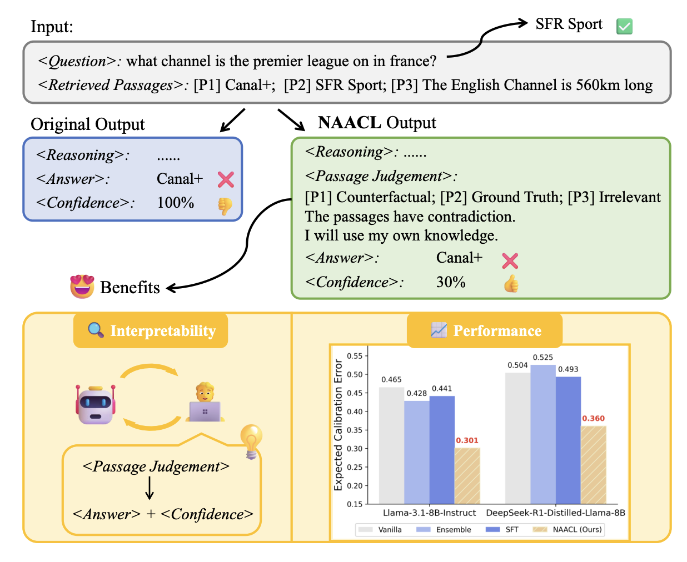
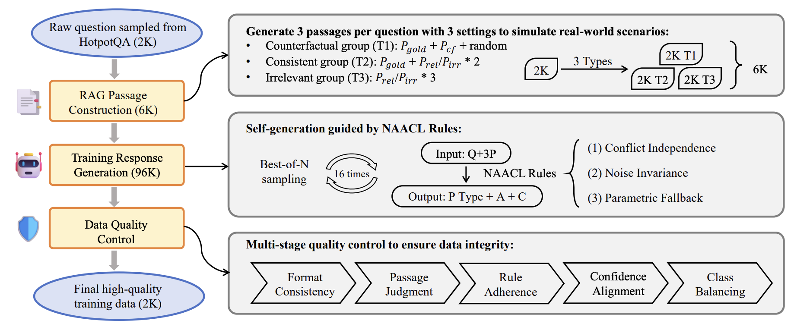

# NAACL

📄 [arXiv](https://www.arxiv.org/abs/2601.11004) •🤗 [Hugging Face](https://huggingface.co/papers/2601.11004) •🐦 [X (Twitter)](https://x.com/jiayujeff/status/2013769332619104509?s=46)

This is the official repository for the paper "**NAACL: Noise-AwAre Verbal Confidence Calibration for LLMs in RAG Systems**".

## 🎯 Project Overview

**NAACL** is a comprehensive framework for improving confidence calibration in large language models (LLMs) within retrieval-augmented generation (RAG) systems. The project addresses a critical challenge: LLMs exhibit poor calibration performance due to noisy retrieved contexts, where contradictory or irrelevant evidence tends to inflate false certainty, leading to severe overconfidence.

The repository systematically evaluates noise robustness and confidence calibration across four benchmarks and provides:

* **🔍 Systematic Noise Analysis**: Studies how different types of noise in retrieved passages affect model confidence calibration
* **📋 NAACL Rules**: Principled foundation for resolving overconfidence under noise
* **🎓 Supervised Fine-tuning**: Noise-aware calibration framework trained on ~2K HotpotQA examples
* **⚖️ Comprehensive Evaluation**: Metrics including accuracy, ECE, AUROC/AUPRC, and calibration diagrams

## ✨ Core Features

* **📚 Multi-Dataset Support**: Evaluation across StrategyQA, HotpotQA, Natural Questions, and Bamboogle
* **🔀 Noise Type Generation**: Four types of synthetic noise (counterfactual, relevant, irrelevant, consistent) for robustness testing
* **🎯 Flexible Inference Tasks**: Multiple task types including baseline inference, checkpoint testing, and RAG evaluation
* **📊 Comprehensive Metrics**: Accuracy, Expected Calibration Error (ECE), AUROC/AUPRC, label accuracy, and reliability diagrams
* **🧠 Multiple Prompting Strategies**: Support for vanilla, chain-of-thought (CoT), and multi-step reasoning with per-step confidence
* **🔄 Modular Design**: Organized into dataset management, noise generation, and inference & evaluation modules



*Figure 1: An illustrative example of model responses before and after NAACL. By explicitly training the model to assess passage- and group-level utility prior to answering, NAACL enables more reliable confidence expression under noisy retrieval, as reflected by consistently reduced ECE. The performance plots report results on NQ for Llama-3.1-8B-Instruct and DeepSeek-R1-DistillLlama-8B, where SFT corresponds to the Label-only SFT setting in Table 2, and illustrate how NAACL promotes more transparent and grounded human–computer interaction in real-world scenarios.*

## 📁 Directory Structure

```
NAACL/
├── datasets/              # Dataset storage
│   ├── original/         # Original QA datasets
│   ├── prepared/         # Preprocessed datasets (3/5 passages per question)
│   └── noise_generated/  # Generated noise passages
├── noise_generation/     # Noise passage generation module
│   ├── inference.py      # Main noise generation script
│   ├── prompt_template.py # Prompt templates for noise types
│   └── generate_noise.sh  # Batch generation script
├── inference/            # Model inference and evaluation
│   ├── generator/        # Model response generation
│   │   ├── budget_forcing.py  # Main inference script
│   │   ├── prompts.py    # Prompt templates
│   │   └── .sh/          # Inference scripts
│   └── eval_utils/       # Evaluation utilities
│       ├── extractor.py  # Answer extraction
│       ├── evaluator.py  # Performance evaluation
│       └── .sh/          # Evaluation scripts
└── rag/                  # RAG-related utilities
```

## 🔄 Workflow

The typical workflow consists of three main steps:

```
1. Prepare Data
   └── datasets/original/ → datasets/prepared/

2. Generate Noise (Optional)
   └── datasets/original/ → datasets/noise_generated/

3. Run Inference & Evaluation
   └── datasets/prepared/ → inference → output/ → evaluation results
```



*Figure 3: Overview of the NAACL data pipeline with three stages: RAG Passage Construction, Training Response Generation, and Multi-stage Data Filtering. Specifically, In the Training Response Generation stage, the model takes a query q and a set of retrieved passages P (where k = 3) as input (denoted as Input: Q+3P). It then generates a reasoning trace containing passage-level and group-level judgments Jp, Jg (denoted as P Type), followed by the predicted answer aˆ (A) and the verbal confidence score cˆ (C). Finally, the pipeline produces 2K high-quality trajectories used for fine-tuning.*

### Detailed Workflow

1. **Data Preparation**: Start with original datasets in `datasets/original/`
2. **Preprocessing**: Prepare datasets with 3 or 5 passages per question → `datasets/prepared/`
3. **Noise Generation** (Optional): Generate synthetic noise passages → `datasets/noise_generated/`
4. **Model Inference**: Generate model responses for QA tasks → `output/`
5. **Answer Extraction**: Extract answers and confidence scores from responses → `output/extracted/`
6. **Evaluation**: Compute metrics (accuracy, ECE, calibration, etc.) → `output/evaluated/`

## 📊 Supported Datasets

- **StrategyQA** - Binary yes/no questions requiring multi-hop reasoning
- **HotpotQA** - Multi-hop question answering with supporting facts
- **Natural Questions (NQ)** - Open-domain question answering
- **Bamboogle** - Binary questions with Google search results

## 🚀 Quick Start

### Installation

```bash
# Clone the repository
git clone https://github.com/yourusername/NAACL.git
cd NAACL

# Install the package in editable mode
pip install -e .

# Or install dependencies only
pip install -r requirements.txt

# Or use conda environment
conda env create -f environment.yml
conda activate <env_name>
```

### Environment Configuration

1. **Local Model Deployment**  
   Start model servers using vLLM for inference:
   ```bash
   vllm serve Qwen/Qwen2.5-7B-Instruct --port 10000
   ```

2. **API Configuration**  
   For noise generation, set API credentials:
   ```bash
   export OPENAI_API_KEY="your-api-key"
   export OPENAI_BASE_URL="your-api-base-url"
   ```
   Or modify `noise_generation/inference.py` directly.

### Running Examples

#### Generate Noise Passages (Optional)

Generate synthetic noise passages for robustness testing:

```bash
# From NAACL/ directory
bash noise_generation/generate_noise.sh

# Or for a specific task:
python noise_generation/inference.py \
    --input_path datasets/original/strategyqa/test.json \
    --output_path datasets/noise_generated/strategyqa/test.json \
    --task gen_counterfactual \
    --max_concurrent_tasks 10
```

#### Run Model Inference

Generate model responses for a QA task:

```bash
# From NAACL/ directory
# Example: base_without_rules task
python inference/generator/budget_forcing.py \
    --input_file datasets/prepared/threePassages/strategyqa/test.json \
    --dataset strategyqa \
    --output_file output/base_without_rules_output.json \
    --task base_without_rules \
    --prompt_type vanilla \
    --question_type bi \
    --sample_num 1 \
    --model_name Qwen/Qwen2.5-7B-Instruct \
    --temperature 0.0
```

#### Extract and Evaluate

Extract answers and evaluate results:

```bash
# From NAACL/ directory
# Auto-detect extractor and run extraction + evaluation
bash inference/eval_utils/.sh/eval.sh output/base_without_rules_output

# Or manually:
python inference/eval_utils/extractor.py \
    --input_path output \
    --output_path output/extracted \
    --extractor base_without_rules \
    --mode overwrite

python inference/eval_utils/evaluator.py \
    --input-dir output/extracted \
    --output-dir output/evaluated \
    --extractor base_without_rules \
    --mode overwrite
```

## 📖 Advanced Usage

For advanced configuration, please refer to the detailed module documentation:

- **[`datasets/README.md`](datasets/README.md)** - Dataset structure and data formats
- **[`noise_generation/README.md`](noise_generation/README.md)** - Noise passage generation guide
- **[`inference/README.md`](inference/README.md)** - Model inference and evaluation guide

### Supported Tasks

The inference module supports five main task types:

- **ckpt_test** - Checkpoint testing with passage labeling
- **base_without_rules** - Baseline inference without specific rules
- **base_pure** - Pure baseline inference
- **base_sample** - Baseline inference with step-by-step reasoning for training data generation
- **rag_test** - RAG testing with different fact sources and prompt types

### Noise Types

The noise generation module supports four types of synthetic passage:

1. **Counterfactual** - Passages that contradict the answer while remaining relevant
2. **Relevant** - Passages that share topics but lack sufficient information
3. **Irrelevant** - Passages with no semantic connection to the question
4. **Consistent** - Passages that support the ground truth answer

### Prompt Types

For RAG testing, the module supports different prompting strategies:

- **vanilla** - Standard prompt without reasoning
- **cot (Chain-of-Thought)** - Step-by-step reasoning
- **multi-step** - Multi-step reasoning with per-step confidence

### Evaluation Metrics

The evaluation module computes:

- **Accuracy** - Answer correctness
- **ECE (Expected Calibration Error)** - Calibration quality
- **AUROC** - Ranking quality of confidence scores
- **Label Accuracy** - Passage label correctness (for ckpt_test)
- **Reliability Diagrams** - Calibration visualization

## 📄 Data Formats

### Input Format

All datasets use JSON format with the following structure:

```json
[
  {
    "id": "sample_001",
    "question": "What is the capital of France?",
    "answer": "Paris",
    "passages": [
      {
        "content": "...",
        "type": "relevant"
      }
    ]
  }
]
```

### Output Format

Model inference outputs add `response` fields:

```json
{
  "id": "sample_001",
  "question": "...",
  "passages": [...],
  "response": {
    "task_name": {
      "prompt_type": ["response1", "response2", ...]
    }
  }
}
```

## 🤝 Contributing

Contributions are welcome! Please feel free to submit Issues and Pull Requests.

## 📝 Notes

- **Root Directory**: All paths in this codebase are relative to the `NAACL/` directory
- **Model Servers**: Ensure model servers are running before inference
- **API Limits**: Adjust `max_concurrent_tasks` based on your API rate limits
- **Extractor Detection**: The evaluation script automatically detects extractors from paths

## 📚 Citing this work

If you use this codebase in your research, please cite:

```bibtex
@misc{liu2026naaclnoiseawareverbalconfidence,
      title={NAACL: Noise-AwAre Verbal Confidence Calibration for LLMs in RAG Systems}, 
      author={Jiayu Liu and Rui Wang and Qing Zong and Qingcheng Zeng and Tianshi Zheng and Haochen Shi and Dadi Guo and Baixuan Xu and Chunyang Li and Yangqiu Song},
      year={2026},
      eprint={2601.11004},
      archivePrefix={arXiv},
      primaryClass={cs.CL},
      url={https://arxiv.org/abs/2601.11004}, 
}
```

## 📄 License

MIT

