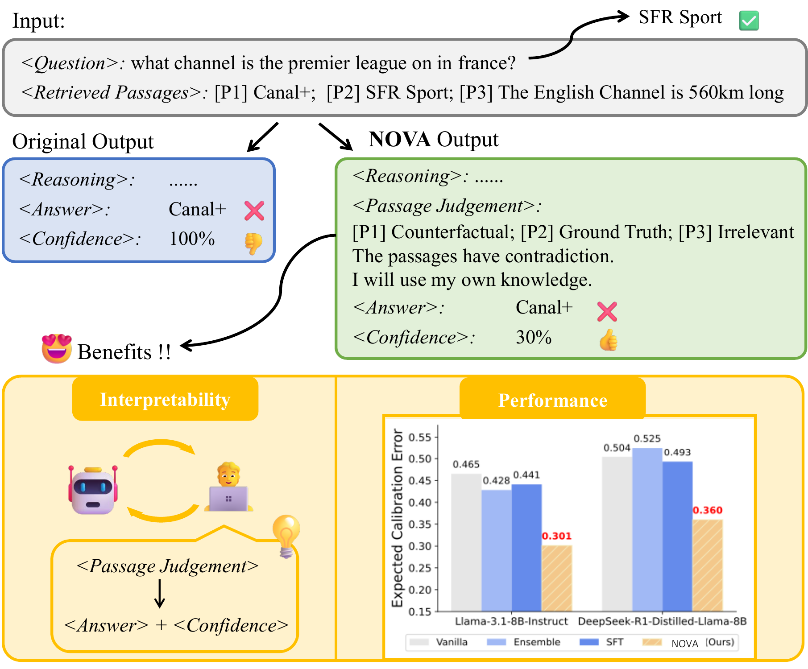
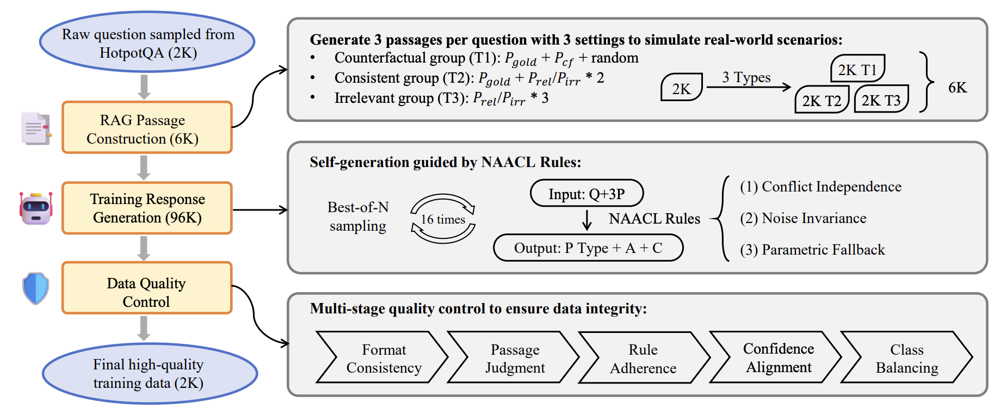

# \[EMNLP 2026 Findings\] NOVA

[Paper](https://arxiv.org/abs/2601.11004) | [Hugging Face paper page](https://huggingface.co/papers/2601.11004) | [X thread](https://x.com/jiayujeff/status/2013769332619104509)

Official code for **NOVA: NOise-aware Verbal Confidence CAlibration for Robust Large Language Models in RAG Systems**, accepted to **Findings of EMNLP 2026**. The repository URL retains its original `NAACL` name for compatibility.

NOVA studies verbal confidence under noisy retrieval and trains language models to explicitly judge passage utility before producing an answer and confidence score. The method uses about 2K filtered HotpotQA trajectories and improves calibration under both controlled retrieval noise and real retrievers.



## What is included

- Final 3/5-passage evaluation datasets for HotpotQA, StrategyQA, Natural Questions, and Bamboogle.
- Synthetic counterfactual, relevant, irrelevant, and consistent passage generation.
- Prompts and OpenAI-compatible inference for the four model backbones used in the paper.
- Answer/confidence extraction and evaluation for accuracy, ECE, AUROC, AUPRC, passage-label accuracy, and reliability diagrams.
- The multi-stage filtering and SFT formatting pipeline used to construct NOVA supervision.
- LLaMA-Factory LoRA configurations matching the final paper settings.

For real-retriever evaluation, `rag_test` accepts a pre-retrieved JSON file with `bm25-facts` and `Contriever-facts` fields.

## Repository layout

```text
.
├── datasets/
│   └── prepared/          # released 3- and 5-passage inputs
├── noise_generation/      # Gemini/OpenAI-compatible noise generation
├── inference/
│   ├── generator/         # prompts, API client, and run scripts
│   ├── eval_utils/        # extraction and calibration metrics
│   └── process_utils/     # training-response filtering/SFT formatting
├── training/              # LLaMA-Factory dataset map and LoRA configs
└── tests/                 # offline smoke test
```

## Installation

Python 3.12 and Linux are recommended for the full CUDA/vLLM environment.

```bash
git clone https://github.com/HKUST-KnowComp/NAACL.git
cd NAACL

conda env create -f environment.yml
conda activate nova
```

For data processing, API-based generation, and evaluation without a local vLLM server, a smaller environment is sufficient:

```bash
python3 -m venv .venv
source .venv/bin/activate
python3 -m pip install -r requirements.txt
```

Validate the installation without a model or network connection:

```bash
python3 tests/smoke_test.py
```

## Inference

NOVA uses an OpenAI-compatible API. Start a vLLM server in one terminal:

```bash
vllm serve Qwen/Qwen2.5-7B-Instruct --port 40002
```

Run a small inference slice in another terminal:

```bash
python3 inference/generator/budget_forcing.py \
  --input_file datasets/prepared/threePassages/strategyqa/test.json \
  --dataset strategyqa-test \
  --output_file inference/output_data/base_pure/quickstart/qwen.json \
  --task base_pure \
  --prompt_type vanilla \
  --question_type bi \
  --sample_num 1 \
  --model_name Qwen/Qwen2.5-7B-Instruct \
  --temperature 0 \
  --port 40002 \
  --end_index 10
```

The scripts in `inference/generator/.sh/` reproduce the four-backbone runs. Edit their dataset/model selections as needed. `base_serve.sh` assumes four visible GPUs and serves one backbone per GPU.

## Evaluation

The wrapper runs extraction followed by evaluation. The extractor can be set explicitly, which is recommended for custom output paths:

```bash
bash inference/eval_utils/.sh/eval.sh \
  inference/output_data/base_pure/quickstart \
  --extractor base_pure
```

Results are written beside the input under `eval_results/<run>/extracted` and `eval_results/<run>/evaluated` unless `--output-base` is supplied. See [inference/README.md](inference/README.md) for task/output schemas.

## Noise generation

Set credentials for Gemini 2.5 Pro or another compatible endpoint:

```bash
export OPENAI_API_KEY="..."
export OPENAI_BASE_URL="https://your-endpoint.example/v1"  # optional for OpenAI
```

Generate one noise type:

```bash
python3 noise_generation/inference.py \
  --input_path datasets/prepared/threePassages/hotpotqa/test.json \
  --output_path inference/output_data/noise/hotpotqa-test.json \
  --task gen_counterfactual \
  --start_idx 0 \
  --end_idx 10 \
  --max_concurrent_tasks 10
```

`bash noise_generation/generate_noise.sh 64` processes every released split and noise type. Outputs default to `inference/output_data/noise_generated/`; existing outputs are resumed. Details are in [noise_generation/README.md](noise_generation/README.md).

## Training data and SFT

The paper samples 16 responses per HotpotQA prompt at temperature 1.0. The four-model wrapper uses these settings:

```bash
bash inference/generator/.sh/base_sample.sh
```

Filter responses and convert the common, balanced examples to LLaMA-Factory format:

```bash
python3 inference/process_utils/filter_rule.py \
  --input inference/output_data/base_sample/<run> \
  --output inference/output_data/base_sample/<run>/filtered \
  --enable-drop 0.05 \
  --tolerate-mismatch

python3 inference/process_utils/sft_format.py \
  --input inference/output_data/base_sample/<run>/filtered \
  --output inference/output_data/base_sample/<run>/sft_formatted
```

The final SFT settings are LoRA rank 16, sequence length 2048, learning rate `5e-5`, and 2 epochs. Copy the generated per-model JSON files and the entries from `training/dataset_info.json` into a LLaMA-Factory checkout, then run the matching config, for example:

```bash
llamafactory-cli train /path/to/NAACL/training/qwen2_5_7b_lora_sft.yaml
```

The reported experiments used four NVIDIA L20 GPUs. Batch size may be reduced for smaller GPUs while increasing gradient accumulation to preserve the effective batch size.



## Reproduction notes

- Backbones: Qwen2.5-7B-Instruct, Llama-3.1-8B-Instruct, DeepSeek-R1-Distill-Qwen-7B, and DeepSeek-R1-Distill-Llama-8B.
- Inference: maximum 2048 output tokens and temperature 0, except training response sampling (`N=16`, temperature 1.0).
- Controlled training/evaluation uses 3 retrieved passages; the 5-passage split is an out-of-distribution evaluation.
- Real RAG uses top-5 BM25 or `facebook/contriever` results without reranking; Contriever inputs are truncated to 256 tokens with 100 KNN candidates.
- Dataset layouts and released sample counts are documented in [datasets/README.md](datasets/README.md).

## Citation

```bibtex
@inproceedings{liu2026nova,
  title     = {{NOVA}: {NO}ise-aware Verbal Confidence {CA}libration for Robust Large Language Models in {RAG} Systems},
  author    = {Jiayu Liu and Rui Wang and Qing Zong and Yumeng Wang and Cheng Qian and Qingcheng Zeng and Tianshi Zheng and Haochen Shi and Dadi Guo and Baixuan Xu and Chunyang Li and Yangqiu Song},
  booktitle = {Findings of the Association for Computational Linguistics: EMNLP 2026},
  year      = {2026},
  url       = {https://arxiv.org/abs/2601.11004}
}
```

## License

This project is released under the [MIT License](license).
